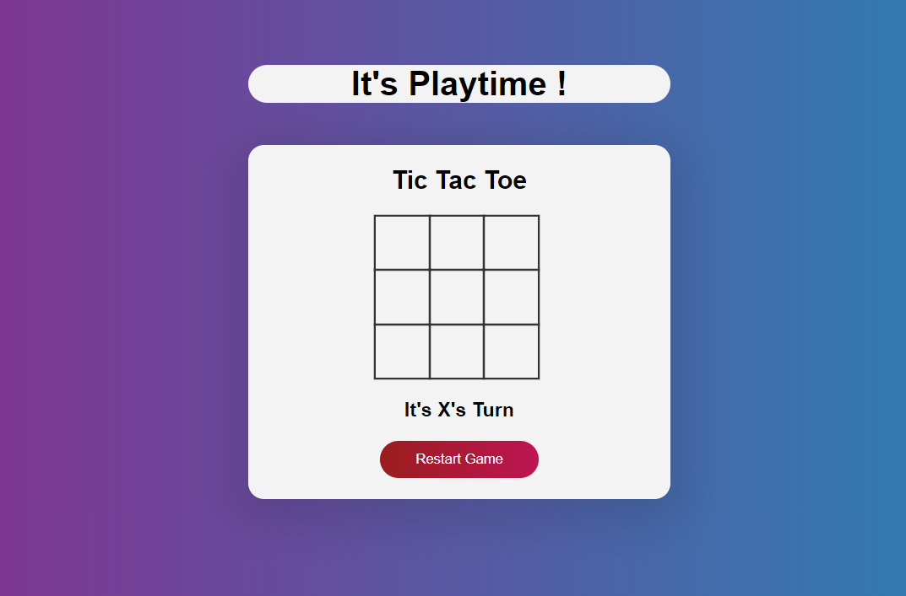

# Tic-Tac-Toe

## Description

Tic-tac-toe, also known as noughts and crosses or Xs and Os, is a classic pencil-and-paper game played by two players. The game is typically played on a 3x3 grid, and the goal is to be the first player to form a line of three of their own symbols, either horizontally, vertically, or diagonally.

The two players take turns placing their symbol (usually "X" for the first player and "O" for the second player) in an empty cell of the grid until one of the players successfully forms a line of three symbols. If all the cells are filled without either player forming a line, the game ends in a draw.

The simplicity of the rules and the quick gameplay make tic-tac-toe a popular game for children and an easy way to pass the time. However, due to its limited possibilities, with perfect play from both sides, the game will always end in a draw. This characteristic also makes it an interesting example in game theory and artificial intelligence studies.

This repository contains an implementation of the Tic-Tac-Toe game in JavaScript. It provides a simple and interactive command-line interface to play the game.

## Features

Overall, tic-tac-toe is a widely recognized and simple game with enduring popularity due to its easy-to-understand rules and potential for educational and entertainment purposes.
The features of the tic-tac-toe game include:

Game Board: The game is played on a 3x3 grid, which forms the game board. Each cell can be empty or occupied by an "X" or "O" symbol.

Player Turns: Two players take turns to play the game. One player usually represents "X," and the other represents "O." The game starts with "X" making the first move.

Symbols: The symbols used in the game are typically "X" and "O," which are used to mark the player's moves on the grid.

Winning Lines: The objective is to create a line of three of your symbols either horizontally, vertically, or diagonally. When a player successfully forms such a line, they win the game.

Move Validations: Players can only place their symbols in empty cells. If a player tries to make an illegal move (e.g., placing a symbol in an occupied cell or outside the grid), the move is invalid, and they must choose a different move.

Draw Condition: If all cells are filled, and neither player has formed a winning line, the game ends in a draw.

User Interface: In modern implementations, tic-tac-toe can be played on various platforms, including physical boards, pencil-and-paper, and electronic devices (computers, smartphones, tablets). User interfaces often include graphical representations of the game board and allow players to interact through touch or mouse inputs.

Multiplayer and Singleplayer: The game can be played by two human players or against a computer AI as an opponent.

Strategy and Tactics: Although the game is simple, players can employ strategies to optimize their chances of winning or forcing a draw. Skilled players can use tactics to create traps or block their opponent's moves.

Educational Value: Tic-tac-toe is often used as an educational tool to teach problem-solving, logic, and strategic thinking to young children.

Limitations: Due to its limited grid size and simple rules, tic-tac-toe has a limited number of possible moves, leading to its characteristic of always ending in a draw with perfect play from both sides.

## Requirements

- [List the prerequisites and dependencies here, e.g., Node.js]

# Installation

Clone repository:

```bash
git clone https://github.com/nesanpacatang/Tic-Tac-Toe.git


How to Play
1. The game board is represented as a 3x3 grid.
2. Players take turns to enter the row and column coordinates (e.g., "1 2") where they want to place their symbol ('X' or 'O').
3. The game ends when either player aligns three symbols in a row, column, or diagonal or when the grid is fully occupied without a winner (a draw).
4. Enjoy the game and have fun!


License
This project is licensed under the MIT License - see the LICENSE file for details.

Contact
If you have any questions, suggestions, or just want to say hi, feel free to contact the project maker at [nesanpacatang@gmail.com].

```

<br>
<br>
<br>
<br>
 
. 

